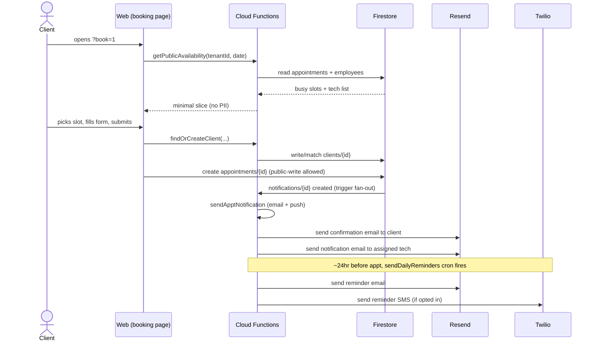
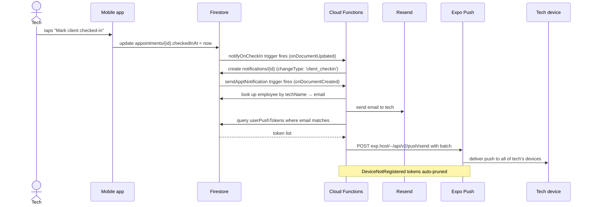
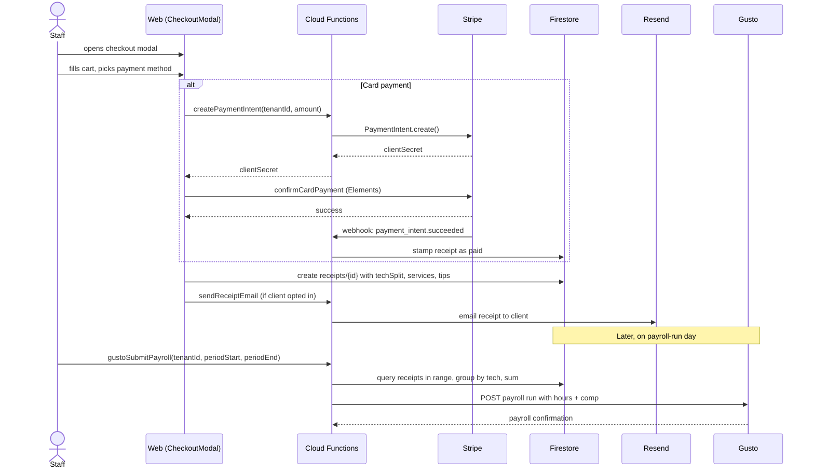
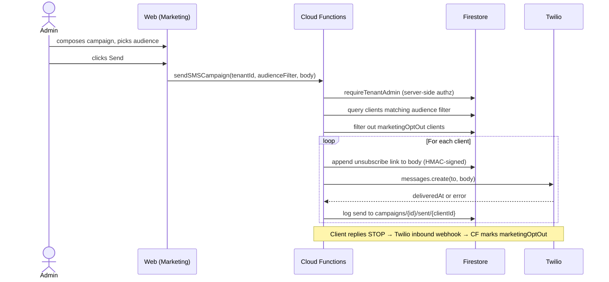
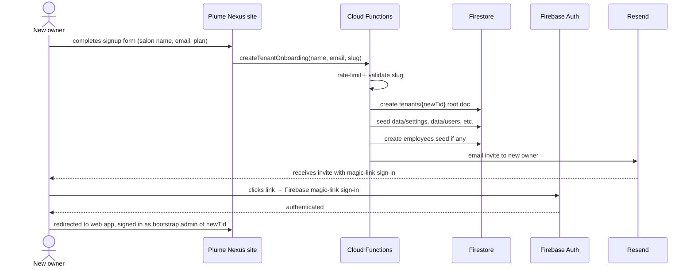

# Architecture

Engineering reference for the Plume Nexus / Meraki Salon Manager stack as of 2026-05-10. This is a working document — update it when the architecture meaningfully changes. For per-module file maps and feature lists, see [`CLAUDE.md`](./CLAUDE.md).

---

## System overview

```mermaid
graph TB
    subgraph Clients["Client surfaces"]
        WebPWA["Web PWA<br/>(admin / tech / scheduler / readonly)"]
        TipFlow["TipFlow kiosk<br/>(front-desk iPad)"]
        Walkin["Walk-in kiosk<br/>(iPad)"]
        Mobile["Native mobile<br/>(Expo SDK 54, iOS/Android)"]
        Public["Public surfaces<br/>booking · check-in · manage · rsvp · unsubscribe"]
        PNSite["plumenexus.com<br/>marketing site"]
        PlatAdmin["platform-admin<br/>(super-admin console)"]
    end

    subgraph Firebase["Firebase project: meraki-salon-manager"]
        Auth["Firebase Auth<br/>(Google · magic link · anonymous)"]
        Fstore["Firestore<br/>tenants/{tid}/..."]
        Funcs["Cloud Functions v2<br/>(54 functions: callables + triggers + cron)"]
        Hosting["Hosting<br/>(3 targets: meraki / plumenexus / platform-admin)"]
        Secrets["Secret Manager<br/>(HMAC keys, Stripe, Twilio, Anthropic)"]
    end

    subgraph External["Third-party services"]
        Stripe["Stripe<br/>(POS · memberships · webhooks)"]
        Twilio["Twilio<br/>(SMS send + inbound webhook)"]
        Resend["Resend<br/>(transactional email)"]
        Gusto["Gusto<br/>(payroll OAuth + 1099s)"]
        Anthropic["Anthropic<br/>(Reports chatbot · voice command)"]
        Expo["Expo Push<br/>(APNS + FCM fan-out)"]
        Google["Google Cloud<br/>(OAuth · Maps · Secret Manager)"]
        CF["Cloudflare Worker<br/>(URL/host rewrites)"]
        Apple["Apple App Store<br/>(distribution)"]
    end

    Clients --> Auth
    Clients --> Fstore
    Clients --> Funcs

    Funcs --> Fstore
    Funcs --> Secrets
    Funcs --> Stripe
    Funcs --> Twilio
    Funcs --> Resend
    Funcs --> Gusto
    Funcs --> Anthropic
    Funcs --> Expo

    Stripe -->|webhooks| Funcs
    Twilio -->|inbound SMS webhook| Funcs
    Gusto -->|OAuth callback| Funcs

    Mobile --> Expo
    Mobile --> Auth
    Mobile --> Fstore
    Mobile -.->|App Store| Apple

    CF -->|rewrites| Hosting
    Hosting --> WebPWA
    Hosting --> PNSite
    Hosting --> PlatAdmin

    classDef firebase fill:#FFA000,stroke:#FF6F00,color:#fff
    classDef external fill:#5b3b8c,stroke:#3d2660,color:#fff
    classDef client fill:#2D7A5F,stroke:#1e5240,color:#fff
    class Auth,Fstore,Funcs,Hosting,Secrets firebase
    class Stripe,Twilio,Resend,Gusto,Anthropic,Expo,Google,CF,Apple external
    class WebPWA,TipFlow,Walkin,Mobile,Public,PNSite,PlatAdmin client
```



---

## Client surfaces

| Surface | Lives at | Purpose | Auth |
|---|---|---|---|
| **Web PWA** | `meraki-salon-manager.web.app` | Day-to-day admin + tech app | Google sign-in (Firebase Auth) |
| **TipFlow kiosk** | Same domain, kiosk view | Tip-suggestion display at front desk | None (kiosk mode) |
| **Walk-in kiosk** | Same domain | Walk-in waitlist on iPad | None (kiosk mode) |
| **Booking page** | `?book=1` | Public online booking | None |
| **Check-in screen** | `?checkin=<apptId>` | Public client self-check-in | Single-shot HMAC-validated update |
| **Manage appointment** | `?manage=<token>` | Client reschedule/cancel from email link | HMAC token (APPT_MANAGE_SECRET) |
| **RSVP** | `?rsvp=<token>` | Internal meeting RSVPs | UUID token (122 bits) |
| **Unsubscribe** | `?unsub=<token>` | Marketing opt-out | HMAC token (UNSUBSCRIBE_SECRET) |
| **Plume Nexus site** | `plumenexus.com` (target: `plumenexus`) | SaaS marketing + signup | None (public) |
| **Platform admin** | Target: `platform-admin` | Super-admin: list/manage all tenants | Bootstrap admin only |
| **Native mobile** | TestFlight / App Store (TBD) | Tech-facing app: schedule, earnings, clients, chat | Native Google Sign-In + Firebase |

---

## Backend

### Cloud Functions inventory (54 total)

Grouped by purpose:

| Category | Functions |
|---|---|
| **Auth + user lookup** | `getMyTenantRole`, `getTenantMetadata` |
| **Public booking + check-in** | `getPublicAvailability`, `getPublicAppointment`, `findOrCreateClient`, `manageAppointment`, `getApptManageLink` |
| **POS / Stripe** | `createPaymentIntent`, `createCheckoutSession`, `stripeWebhook`, `createMembershipCheckout`, `createMembershipPortal`, `emailMembershipPaymentLink`, `retryGiftCardEmail` |
| **Email (Resend)** | `sendApptNotification`, `sendDailyReminders`, `sendTechAppointmentReminders`, `sendReceiptEmail`, `sendReviewRequestEmail`, `sendReviewReceivedNotification`, `sendGiftCardEmail`, `sendChatNotification`, `sendBookingConfirmation`, `sendDirectEmail`, `emailEmployeeInvite`, `sendAccessRequestNotification` |
| **SMS (Twilio)** | `sendDirectSms`, `sendSMSCampaign`, Twilio inbound webhook (server-side route) |
| **Marketing** | `sendMarketingCampaign`, `runScheduledCampaigns`, `autoBirthdayCampaign`, `autoLapsedCampaign`, `chatWithMarketing`, `draftConflictMessages` |
| **AI (Anthropic)** | `chatWithReports`, `chatWithSalon`, `chatWithMarketing` (yes, two callables share AI for marketing context) |
| **Meetings / RSVP** | `sendMeetingInvites`, `sendMeetingReminders`, `recordMeetingResponse`, `fetchMeetingForRsvp` |
| **Gusto (payroll)** | `gustoGetAuthUrl`, `gustoOAuthCallback`, `gustoSyncEmployees`, `gustoSubmitPayroll`, `generateAnnual1099s` |
| **Tenant lifecycle** | `createTenantOnboarding`, `listTenants`, `refreshGoogleReviews` |
| **Triggers** | `notifyOnCheckIn` (Firestore onDocumentUpdated), `sendApptNotification` (notifications onCreate) |
| **Unsubscribe** | `processUnsubscribe` |

### Firestore data model (multi-tenant)

```
tenants/{tid}/                              ← Tenant root doc
  ├── data/
  │   ├── settings                          ← Per-tenant settings (staff-readable)
  │   ├── settingsPrivate                   ← Admin-only secrets (Gusto tokens, etc.)
  │   ├── users                             ← Slim role projection (staffEmails/adminEmails)
  │   ├── usersFull                         ← Rich users[] array (admin-only)
  │   └── slides                            ← TipFlow slides
  ├── services/{id}                         ← Service menu
  ├── clients/{id}                          ← Client profiles
  ├── employees/{id}                        ← Public employee data
  │   └── private/comp                      ← Admin-only: SSN, comp, banking
  ├── appointments/{id}                     ← Bookings
  ├── receipts/{id}                         ← POS transactions
  ├── chats/{clientId}                      ← Per-client message thread
  ├── notifications/{id}                    ← Email + push fan-out queue
  ├── userPushTokens/{uid}                  ← Expo push tokens, per user
  ├── giftCards/{id}                        ← Gift card balances
  ├── memberships/{id}                      ← Membership records
  ├── meetings/{id}                         ← Internal meeting docs
  ├── timeOff/{id}                          ← Vacation / sick / personal
  └── logs/{id}                             ← Activity audit log

_oauthNonces/{nonce}                        ← Gusto OAuth state pin (single-use, TTL'd)
```

### Hosting targets

| Target | Site | Source | URL |
|---|---|---|---|
| `meraki` | `meraki-salon-manager` | `dist/` (web app build) | `meraki-salon-manager.web.app` |
| `plumenexus` | `plumenexus` | `plumenexus/dist/` (marketing site) | `plumenexus.com` |
| `platform-admin` | Hostname TBD | `platform-admin/dist/` (super-admin console) | TBD |

Deploys via `firebase deploy --only hosting:meraki` etc. Staging via Firebase Hosting Channels (`deploy:staging` → `promote:staging`).

---

## Third-party integrations

| Provider | Purpose | Where wired | Env vars / secrets | Account owner |
|---|---|---|---|---|
| **Stripe** | POS PaymentIntents · subscriptions · webhooks | `createPaymentIntent`, `createMembershipCheckout`, `stripeWebhook` | `STRIPE_SECRET_KEY` (secret), `STRIPE_WEBHOOK_SECRET` (secret), `STRIPE_PRO_PRICE_ID`, `STRIPE_STARTER_PRICE_ID` | Jonathan |
| **Twilio** | SMS send + inbound webhook | `sendDirectSms`, `sendSMSCampaign`, `twilioInboundSms` | `TWILIO_AUTH_TOKEN` (secret), `TWILIO_ACCOUNT_SID`, `TWILIO_API_KEY_SID`, `TWILIO_FROM` | Jonathan |
| **Resend** | All transactional email | All `send*Email` functions | `RESEND_API_KEY` | Jonathan |
| **Gusto** | Payroll OAuth + submit + 1099s | `gustoOAuthCallback`, `gustoSubmitPayroll`, etc. | `GUSTO_CLIENT_ID`, `GUSTO_CLIENT_SECRET`, `GUSTO_REDIRECT_URI` | Jonathan |
| **Anthropic** | Reports chatbot · voice command parsing | `chatWithReports`, `chatWithSalon`, `chatWithMarketing`, `voiceCommand` | `ANTHROPIC_API_KEY` (secret) | Jonathan |
| **Google Cloud** | OAuth (web + iOS clients) · Maps API · Firebase | Firebase Console + Cloud Console | `GOOGLE_MAPS_API_KEY`, OAuth client IDs in mobile app source | Jonathan |
| **Expo / EAS** | Mobile build pipeline · push fan-out | `mobile/`, `sendApptNotification` (push fan-out) | EAS project ID in `mobile/app.json` | Jonathan (`@jvankim`) |
| **Apple Developer** | App Store distribution | EAS Build signing | Pending verification as of 2026-05-10 | Jonathan |
| **Cloudflare Worker** | URL / host rewrites | `cloudflare/worker.js`, deployed via `wrangler` | Cloudflare account creds | Jonathan |
| **GitHub** | Origin · code hosting | `vankimj/Meraki-Salon-Manager` | — | Jonathan |
| **GlossGenius** | CSV importer (one-way) | Admin → Import from GlossGenius | None (manual CSV) | — |
| **ngrok** | Dev tunnel for Expo only | `mobile/` dev | Local install only | — |

---

## Data flow walkthroughs

### 1. Online booking → confirmation → reminder



### 2. Tech checks in client → tech notification (push + email)



### 3. POS checkout → receipt → payroll



### 4. Marketing campaign — SMS send



### 5. New tenant onboarding (SaaS signup)



---

## Secrets & environment

### Stored in Cloud Secret Manager (defineSecret)

These are NEVER plaintext in `.env` — overlap with secret env vars would fail deploy. Set via:

```bash
firebase functions:secrets:set <NAME>
```

| Name | Used by |
|---|---|
| `UNSUBSCRIBE_SECRET` | HMAC-sign + verify unsubscribe links |
| `APPT_MANAGE_SECRET` | HMAC-sign + verify appointment-manage links |
| `STRIPE_SECRET_KEY` | All Stripe API calls |
| `STRIPE_WEBHOOK_SECRET` | Verify Stripe webhook signatures |
| `TWILIO_AUTH_TOKEN` | Twilio API auth + signature-verify inbound webhook |
| `ANTHROPIC_API_KEY` | Reports chatbot, voice command, marketing AI |

### Stored in `functions/.env` (defineString — non-secret config)

| Name | Used for |
|---|---|
| `RESEND_API_KEY` | Resend API auth (worth promoting to defineSecret eventually) |
| `RESEND_FROM` | Default sender; overridden per-tenant via `data/settings.fromAddress` |
| `GOOGLE_MAPS_API_KEY` | Address autocomplete in client/employee forms |
| `PUBLIC_APP_URL` | Default unsubscribe + manage-appt link base |
| `TWILIO_ACCOUNT_SID`, `TWILIO_API_KEY_SID`, `TWILIO_FROM` | Twilio config |
| `STRIPE_PRO_PRICE_ID`, `STRIPE_STARTER_PRICE_ID` | Stripe pricing for self-service signup |
| `GUSTO_CLIENT_ID`, `GUSTO_CLIENT_SECRET`, `GUSTO_REDIRECT_URI` | Gusto OAuth |

---

## Failure modes

What breaks when each integration is down, and what the user sees:

| Provider down | Visible impact | Mitigation in place |
|---|---|---|
| **Firebase Auth** | Nobody can sign in | None — Firebase Auth uptime is Google's SLA |
| **Firestore** | Entire app broken — nothing loads | None |
| **Cloud Functions** | Callables fail; emails/SMS queue but don't fire | Firestore writes (notifications/{id}) buffer until functions return |
| **Stripe** | POS card payments fail; cash/check still work | Cash fallback always available |
| **Twilio** | SMS fails (campaigns + reminders); email reminders still go | Email reminders are primary channel |
| **Resend** | Email fails (receipts + reminders + notifications) | Notifications doc stays unsent for retry; admin sees `error` field |
| **Gusto** | Payroll submit fails | Admin reverts to running payroll manually in Gusto's own UI |
| **Anthropic** | Reports chatbot returns "AI unavailable"; voice command falls back to manual entry | Non-AI Reports still work; voice is optional |
| **Expo Push** | Mobile alerts don't deliver; email notifications still go | Email is primary, push is secondary |
| **Cloudflare Worker** | Some URL/host rewrites fail | Plume Nexus marketing site uses direct Firebase Hosting |
| **GlossGenius** | (only matters during one-time migration) | Manual CSV re-export |

---

## Deploy targets reference

| Action | Command |
|---|---|
| Web staging | `npm run deploy:staging` |
| Web production | `npm run promote:staging` (re-builds, doesn't clone — required) |
| Single function | `firebase deploy --only functions:<fnName>` |
| All functions | `firebase deploy --only functions` |
| Firestore rules | `firebase deploy --only firestore:rules` |
| Hosting target | `firebase deploy --only hosting:<target>` |
| Plume Nexus site | `firebase deploy --only hosting:plumenexus` |
| Platform admin | `firebase deploy --only hosting:platform-admin` |
| Mobile dev client | `cd mobile && eas build --profile development --platform ios` |
| Mobile sim build | `cd mobile && eas build --profile development-simulator --platform ios` |
| Mobile production | `cd mobile && eas build --profile production --platform ios` |
| Mobile App Store submit | `cd mobile && eas submit --platform ios` |
| Cloudflare Worker | `cd cloudflare && wrangler deploy` |

---

## Versioning

This doc is checked into `main`. Update it when:

- A new third-party integration is added or removed
- The Firestore tenant model gets a new root collection
- A new hosting target is created
- The deploy workflow changes
- A new failure mode is discovered (with mitigation)

Last updated: 2026-05-10.
